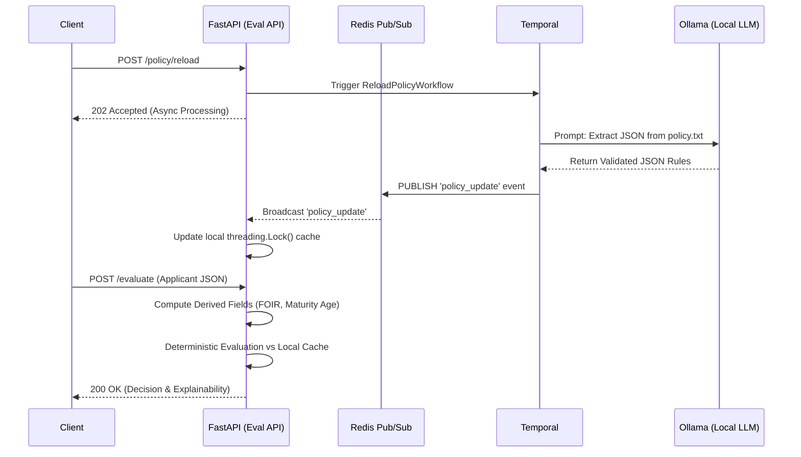

# Prayaan Capital: Credit Policy Engine (SDI Architecture)

## 1. Executive Summary
This project implements a highly scalable, deterministic Credit Policy Evaluation Engine for MSME lending. It strictly adheres to the **Smart Data Injection (SDI)** paradigm, separating the non-deterministic parsing of natural language policies from the mathematical execution of applicant data.

**Key Achievements:**
* **Zero PII Exposure:** Applicant data never enters an LLM context window.
* **100% Determinism:** Evaluations are mathematical, achieving zero recall-risk compared to semantic RAG approaches.
* **Distributed Hot-Reloading:** Safe, zero-downtime policy updates across multiple API pods using Temporal and Redis Pub/Sub.
* **Millisecond Latency:** API evaluations execute in O(1) time via an in-memory thread-safe cache.

## 2. System Architecture



## 3. Technology Stack & Design Justifications
* **FastAPI + Pydantic V2:** Chosen for hyper-fast execution and strict, automatic schema validation (calculating FOIR/Maturity Age instantly upon payload ingestion).
* **Temporal.io:** Local LLMs (Ollama) are prone to timeouts and hallucination failures. Temporal guarantees durable execution, retrying the LLM parsing until a valid Pydantic schema is generated, ensuring no dropped requests.
* **Redis Pub/Sub:** Enables safe, instantaneous cache-invalidation across a distributed cluster of FastAPI pods when a new policy is compiled.
* **Why No RAG / Vector DB:** Semantic retrieval introduces non-deterministic recall risk (missing critical compliance rules). By using the LLM as an offline compiler rather than a runtime interpreter, we guarantee absolute compliance and explainability.

## 4. API Documentation

### `POST /evaluate`
Evaluates an applicant against the currently active policy cache.
* **Request Body:** `ApplicantPayload` JSON
* **Response:**
```json
{
  "application_id": "APP-2024-00192",
  "decision": "NEEDS_REVIEW",
  "reason": "Failed 1 MEDIUM rules.",
  "rules_evaluated": [
    {
      "rule_id": "R-07",
      "rule_text": "Fixed Obligation to Income Ratio (FOIR) must not exceed 50%.",
      "applicant_value": 52.5,
      "threshold": 50,
      "passed": false
    }
  ]
}
```

### `POST /policy/reload`
Triggers the asynchronous Temporal workflow to re-parse `/data/policy.txt` via Ollama.
* **Response:** `202 Accepted`

## 5. Local Setup Instructions
1. Ensure Docker and Docker Compose are installed.
2. Clone the repository and navigate to the root directory.
3. Run: `docker-compose up -d --build`
4. The API will be available at `http://localhost:8000/docs`.


### **3. The Core Codebase**

```text
prayaan-engine/
├── app/
│   ├── main.py
│   ├── core/state.py
│   ├── models/schemas.py
│   ├── services/engine.py
├── worker/
│   ├── policy_workflow.py
├── data/
│   └── policy.txt
├── docker-compose.yml
├── requirements.txt
└── README.md
```

#### **A. The Models & Contracts (`app/models/schemas.py`)**
```python
from pydantic import BaseModel, Field, model_validator
from typing import List, Literal, Union, Any

class LoanRequest(BaseModel):
    amount: float = Field(..., gt=0)
    tenure_months: int = Field(..., gt=0)

class ApplicantPayload(BaseModel):
    application_id: str
    age: int = Field(..., gt=18, lt=100)
    monthly_income: float = Field(..., gt=0)
    existing_emi_obligations: float = Field(default=0.0, ge=0)
    credit_score: int
    loan_request: LoanRequest
    
    # Derived Fields
    foir: float = 0.0
    loan_maturity_age: float = 0.0

    @model_validator(mode='after')
    def compute_derived_fields(self):
        self.loan_maturity_age = self.age + (self.loan_request.tenure_months / 12)
        # Simplified FOIR calculation assuming 1.5% monthly flat interest for proposed EMI
        r = 0.015 
        p = self.loan_request.amount
        n = self.loan_request.tenure_months
        proposed_emi = (p * r * (1 + r)**n) / ((1 + r)**n - 1)
        self.foir = ((self.existing_emi_obligations + proposed_emi) / self.monthly_income) * 100
        return self

class RuleSchema(BaseModel):
    rule_id: str
    rule_text: str
    field: str
    operator: Literal[">", ">=", "<", "<=", "=="]
    threshold: Union[float, int]
    severity: Literal["HIGH", "MEDIUM", "LOW"]

class RuleResult(BaseModel):
    rule_id: str
    rule_text: str
    applicant_value: Any
    threshold: Any
    passed: bool

class DecisionResponse(BaseModel):
    application_id: str
    decision: Literal["APPROVED", "NEEDS_REVIEW", "REJECTED"]
    reason: str
    rules_evaluated: List[RuleResult]
```

#### **B. The Deterministic Engine (`app/services/engine.py`)**
```python
import operator
from typing import List
from app.models.schemas import ApplicantPayload, RuleSchema, DecisionResponse, RuleResult

OPERATORS = {
    ">": operator.gt, ">=": operator.ge,
    "<": operator.lt, "<=": operator.le,
    "==": operator.eq
}

class DeterministicRuleEngine:
    def evaluate(self, applicant: ApplicantPayload, rules: List[RuleSchema]) -> DecisionResponse:
        results = []
        failed_high = 0
        failed_medium = 0

        for rule in rules:
            try:
                applicant_value = getattr(applicant, rule.field)
                op_func = OPERATORS[rule.operator]
                threshold_val = type(applicant_value)(rule.threshold)
                passed = op_func(applicant_value, threshold_val)
            except (AttributeError, ValueError, KeyError):
                passed = False
                applicant_value = "EVALUATION_ERROR"

            results.append(RuleResult(
                rule_id=rule.rule_id,
                rule_text=rule.rule_text,
                applicant_value=applicant_value,
                threshold=rule.threshold,
                passed=passed
            ))

            if not passed:
                if rule.severity == "HIGH": failed_high += 1
                if rule.severity == "MEDIUM": failed_medium += 1

        if failed_high > 0:
            decision, reason = "REJECTED", f"Failed {failed_high} HIGH severity rules."
        elif failed_medium > 0:
            decision, reason = "NEEDS_REVIEW", f"Failed {failed_medium} MEDIUM rules."
        else:
            decision, reason = "APPROVED", "All rules passed."

        return DecisionResponse(
            application_id=applicant.application_id,
            decision=decision,
            reason=reason,
            rules_evaluated=results
        )
```

#### **C. The Distributed State (`app/core/state.py`)**
```python
import threading
import json
import redis.asyncio as redis
from typing import List
from app.models.schemas import RuleSchema

class DistributedPolicyState:
    _instance = None
    _lock = threading.Lock()

    def __new__(cls):
        if cls._instance is None:
            with cls._lock:
                if cls._instance is None:
                    cls._instance = super().__new__(cls)
                    cls._instance.rules: List[RuleSchema] = []
                    cls._instance._rw_lock = threading.Lock()
                    # In a real environment, load Redis host from ENV
                    cls._instance.redis_client = redis.Redis(host='redis', port=6379, decode_responses=True)
        return cls._instance

    def get_rules(self) -> List[RuleSchema]:
        with self._rw_lock:
            return list(self.rules)

    async def listen_for_invalidations(self):
        pubsub = self.redis_client.pubsub()
        await pubsub.subscribe("policy_updates")
        async for message in pubsub.listen():
            if message["type"] == "message":
                new_rules_data = json.loads(message["data"])
                with self._rw_lock:
                    self.rules = [RuleSchema(**r) for r in new_rules_data]
                print(f"State Synced: {len(self.rules)} rules hot-reloaded.")

policy_state = DistributedPolicyState()
```

#### **D. The Temporal Workflow (`worker/policy_workflow.py`)**
```python
from temporalio import workflow, activity
from datetime import timedelta
import httpx
import json
import redis

@activity.defn
async def extract_rules_from_llm(policy_text: str) -> list:
    prompt = f"""
    You are a strict compliance bot. Extract rules to JSON matching schema:
    [{{ "rule_id": "str", "rule_text": "str", "field": "foir|credit_score|loan_maturity_age", "operator": ">|<|>=|<=", "threshold": float, "severity": "HIGH|MEDIUM" }}]
    Policy: {policy_text}
    Output ONLY valid JSON.
    """
    async with httpx.AsyncClient(timeout=120.0) as client:
        # Assuming Ollama is running at ollama:11434 in docker-compose
        res = await client.post("http://ollama:11434/api/generate", json={
            "model": "llama3",
            "prompt": prompt,
            "format": "json",
            "stream": False
        })
        return json.loads(res.json()["response"])

@activity.defn
async def broadcast_new_rules(rules: list):
    r = redis.Redis(host='redis', port=6379)
    r.publish("policy_updates", json.dumps(rules))

@workflow.defn
class ReloadPolicyWorkflow:
    @workflow.run
    async def run(self, policy_text: str):
        rules_json = await workflow.execute_activity(
            extract_rules_from_llm, 
            policy_text, 
            start_to_close_timeout=timedelta(minutes=3)
        )
        await workflow.execute_activity(
            broadcast_new_rules, 
            rules_json,
            start_to_close_timeout=timedelta(seconds=10)
        )
        return "Hot-Reload Complete."
```

#### **E. The FastAPI Orchestrator (`app/main.py`)**
```python
from fastapi import FastAPI, HTTPException
import asyncio
from temporalio.client import Client
from app.core.state import policy_state
from app.models.schemas import ApplicantPayload, DecisionResponse
from app.services.engine import DeterministicRuleEngine

app = FastAPI(title="Prayaan Credit Engine")
engine = DeterministicRuleEngine()

@app.on_event("startup")
async def startup_event():
    asyncio.create_task(policy_state.listen_for_invalidations())

@app.post("/evaluate", response_model=DecisionResponse)
async def evaluate(payload: ApplicantPayload):
    rules = policy_state.get_rules()
    if not rules:
        raise HTTPException(status_code=503, detail="Rules not loaded. Call /policy/reload first.")
    return engine.evaluate(payload, rules)

@app.post("/policy/reload", status_code=202)
async def trigger_reload():
    with open("data/policy.txt", "r") as f:
        text = f.read()
    
    # In production, cache the client connection
    client = await Client.connect("temporal:7233")
    await client.execute_workflow(
        "ReloadPolicyWorkflow",
        text,
        id="policy-reload-job",
        task_queue="policy-queue"
    )
    return {"status": "Reload workflow triggered. Listening for Redis invalidation."}
```
